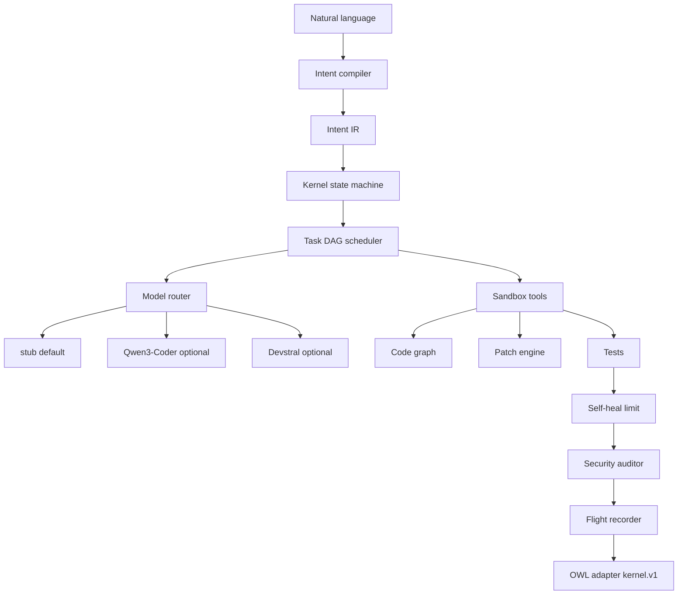

# Architecture

## State machine

CREATED → PLANNED → READY → RUNNING → VERIFYING → COMPLETED  

Illegal transitions raise `TransitionError`. RUNNING interrupted at process start becomes FAILED (never blindly repeated).

## Permissions

READ / WRITE / EXECUTE / NETWORK / SECRETS / GIT  

SECRETS is never granted. NETWORK is off by default. Path traversal and hidden paths are blocked. Python in the sandbox is AST-scanned.

## Agents (roles, not clones)

Architect, Researcher, Coder, Debugger, Tester, Security, Docs — different default permissions.

## Not yet implemented (honest)

- Tree-sitter backends (Python `ast` is live)
- HTTP server wrapping `adapter_owl` (functions exist)
- Speculative multi-candidate tournaments
- Human-approval UI (policy flags exist: isolated workspace is the default “approval”)
