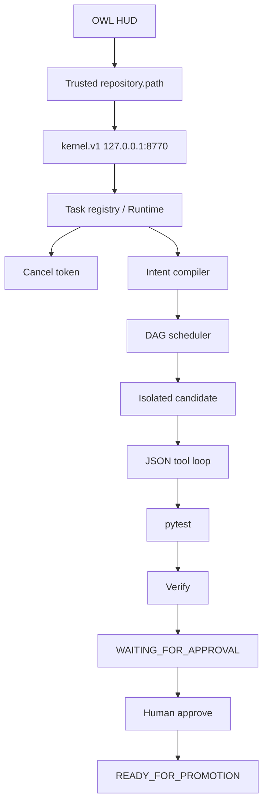

# Architecture

Repository targeting is resolved and canonicalized **before** snapshot. The model never supplies the path.

Cancellation is a `CancelToken` on the Runtime, checked in the scheduler, agent loop, and pytest subprocess.

Approval is a Runtime method. `actor` must be `"human"`. Origin is not written.

`mock-coder` is a test-oracle synthesizer, not an LLM.
