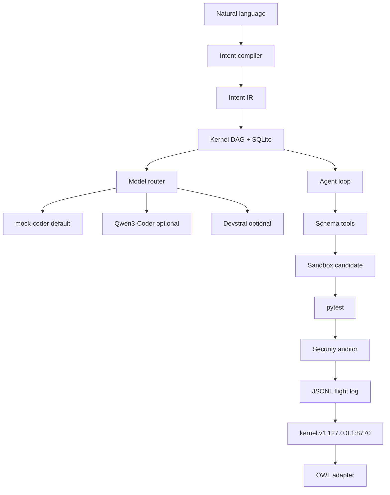

# Architecture

## What is real

- Compiler: deterministic IR, cycle check, injection refusal on the **user goal**.
- Scheduler: READY waves; independent READ kinds may run concurrently; writes stay serial.
- Candidate: copy-on-write workspace. Origin is immutable. Discard deletes the copy.
- Agent loop: JSON actions only. Unknown / unauthorized / malformed → reject.
- Roles: researcher cannot `apply_patch`. Coder cannot `run_tests`. Debugger can both.
- Default coding model: `mock-coder` (oracle synthesizer). Giants only if their URL is healthy.
- HTTP: compile / start / cancel / get / list / trace / approve / health. Loopback only.

## State machine

CREATED → PLANNED → READY → RUNNING → VERIFYING → COMPLETED  
FAILED → RETRYING → READY  
RUNNING → WAITING_FOR_APPROVAL → READY  
RUNNING interrupted at process start → FAILED (not blindly repeated). Destructive kinds are not auto-retried.

## Permissions

READ / WRITE / EXECUTE / NETWORK / SECRETS / GIT  

SECRETS is never granted. NETWORK is off. Path traversal and hidden paths are blocked. Python is AST-scanned. This is **application-level** confinement, not a hardware/OS sandbox.

## Replay

JSONL events can be listed. Replay does **not** re-execute tools against the world.

## Not implemented

- Tree-sitter
- Promoting an isolated candidate onto the origin git branch
- Container / seatbelt / sandbox-exec
- Loading two giant models
